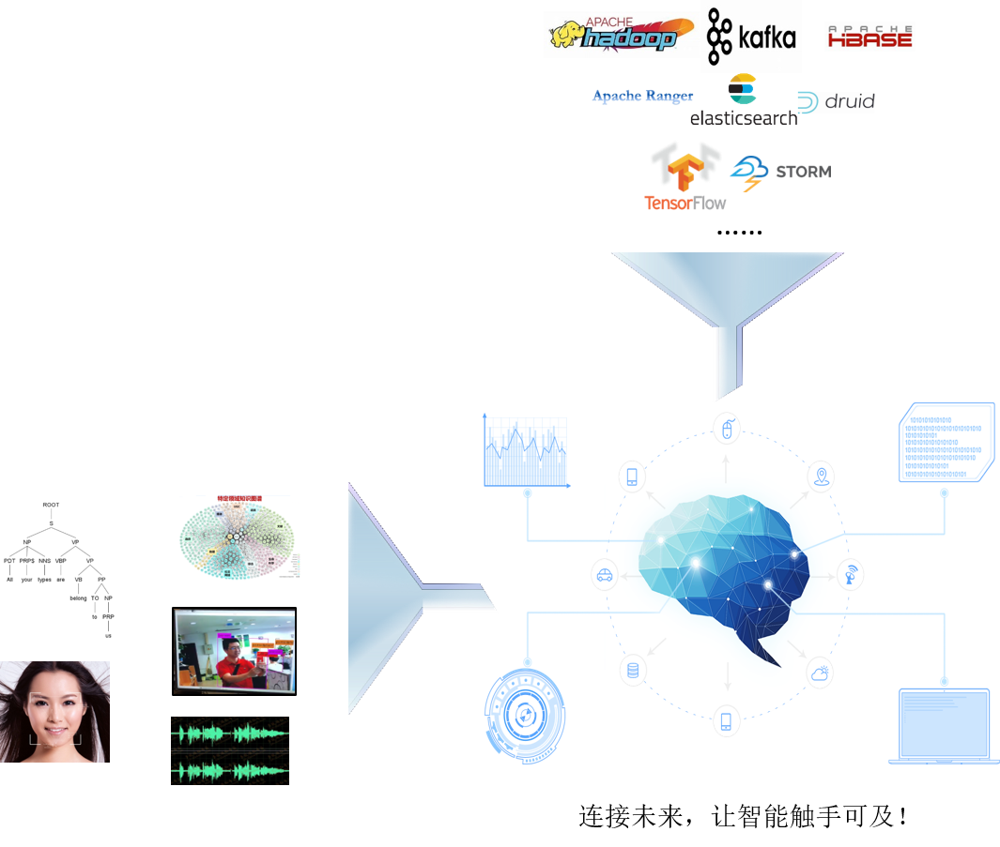

数智大脑：大数据智能综合治理平台
============

概述
--------

数智大脑，是团队研发的一站式大数据智能综合治理平台，简称DataBrainOS。
该平台是公司核心骨干综合多年大数据、人工智能及流数据平台的建设经验和技术积累，
构建的能够满足各类组织数智化转型需求和进行数智创新的赋能平台。

该平台产品可完全处理混合负载（OLTP， OLAP，流式数据等），提供数据探索、模型构建、实时交互式查询/分析、
机器学习、数智应用构建与部署等功能能有效推动组织业务服务模式和业务运营方式的创新，
并且逐步帮助各类组织快速转型为面向未来的 DT 组织。

该平台让组织拥有：

- 安全可靠的数智大脑
- 业务活数据接入汇聚分析能力
- 创建并提供精准智能化服务能力
- 快速开发数智应用的能力
- 不断审视数据智能能力，升级产品，提供更多数据智能服务

    大数据智能综合治理平台示意图

同时，机构组织采用该平台也能快速创建、测试、部署自己的业务应用，与传统的大数据及人工智能应用开发和部署相比，
采用数智大脑进行数智应用的开发能够大大降低组织的总体拥有成本（TCO）。

该平台可帮助企业自身及客户组织完成数智应用的统一开发、测试、部署和管理，满足用户研发、测试、
部署、上线生产并提交数智业务服务的多样化需求，为组织构建数智应用及相关服务提供一个开箱即用的解决方案。
不仅大大降低了企业开发提供数智应用服务的门槛，而且帮助企业进行产品多元化和产品定制化服务，
从而大幅提高数智应用的交付效率。

面向未来的意义所在
---------------

站在未来看现在，我们认为未来所有的应用都必将是数据智能应用，从开放方法论上和现在有本质差别。
核心数智应用服务主要在平台端实现，平台赋能各种前端应用。数智应用研发对数据科学家和后台工程的要求增强，
对应用端人员的技能要求会大大降低。

降低大数据及人工智能的技术门槛
*********************

大数据及人工智能的技术门槛较高，通常需要开发者充分了解系统的底层架构，具备集群部署、操作、应用程序开发等各种能力，
极大的限制了大数据及人工智能的普及与应用。
为了解决上述问题，DataBrainOS 应运而生。DataBrainOS 支持快速安装，详细的安装文档助力大数据智能平台的搭建；
DataBrainOS 采用拖拽式开发，大大降低了开发难度，缩短了数据智能应用的开发周期；
DataBrainOS 整合了常用的大数据和人工智能工具，提供大数据智能一站式操作平台，
提供了从数据探索、数据发现、数据建模、数智应用接口开发和管理、数智应用研发到应用部署全生命周期支撑；
DataBrainOS 提供了可视化运维，使基于大数据和人工智能技术为核心的分布式系统运维变得更加高效、便捷。
DataBrainOS 大大的降低了大数据及人工智能的门槛，使得大数据及人工智能触手可及。DataBrainOS
构建的使命就是让每个组织拥有自己自主可控的数智大脑。

一站式解决方案解决了安全运维等核心问题
***************

从数据智能建模、数据智能探索、数据智能部署到智能应用开发，均可在数值大脑中实现。

首先，平台支持丰富的机器学习和深度学习框架，大大降低人工智能技术的使用和应用门槛。
机器学习和深度学习的出色表现，越来越赢得各行业生产发展的青睐。平台整合了H2O.AI，
支持大部分主流算法。公司自主研发的 AI Manager，支持模型训练、模型管理、模型部署、服务的申请订阅、在线预测等，
图形化的操作界面极大的降低了人工智能的门槛。

其次，该平台提供了自动化运维的支撑。基于容器云搭建的 DataBrainOS 平台，更易于运维。
包括：日志采集、实时监控、自动伸缩、平台迁移等。

最后，该平台提供了统一的安全和多租户管理功能。

数据的安全问题是大数据开发的一大关键问题，Hadoop 或 Kafka 的安全问题对于将产品投入实际生产而言是一个极大的挑战。 
2017 年年初开始，国际上发生了一系列的 HDFS 入侵事件，Hadoop 集群被攻击的案件不断被报道出来。为了保障平台安全，
更好的认证和授权服务成为刚需。实现了所有应用服务都可以借助 Kerberos 实现数据加密，
或者通过Kerberos 实现身份验证，大大提升了平台的安全等级。同时 DataBrainOS 集成 ranger 统一权限管理系统，
通过 ranger 可以方便的对 DataBrainOS 各个组件进行权限管理和审计等功能。

综上所述，该平台将大大降低企业和个人利用大数据和人工智能的门槛，极大地提升任何组织的数据化和数智化转型效率，
将带来较大的经济和社会效益。

核心技术创新点及先进性
---------------

极致的性能与可扩展性
****************

DataBrainOS 不仅可以对 GB 到 PB 级的数据量实现复杂的查询和分析，而且在大数据实时数据处理方面，
表现优异。DataBrainOS 具有高可扩展性，用户可以通过增加集群节点数量，线性提高系统的处理能力。

低延迟的流处理
**************

DataBrainOS 同时支持事件驱动和流处理操作。在 DataBrainOS Data Preprocessor、
DataBrainOS Data Analyzer、Storm、Kakfa、Hbase 等组件的完美搭配下，可处理任何形式与结构的数据，
快速完成数据的获取、清洗、分析与存储。

快速构建可视化看板
**************

DataBrainOS 平台支持用户通过SQL等方式在线访问数据、构建可视化看板，并支持看板的复用和发布。
应用开发人员可复用可视化看板丰富自己的应用UI。可视化看板内容会随数据变化而刷新。

图形化的大数据智能治理平台
*************

在 DataBrainOS 平台中，不仅仅融合了十几种大数据开发常用的工具，而且支持用户自定义组件，
以适应各种实际开发需求。DataBrainOS 平台提供可视化操作界面，操作人员通过简单的拖拽即可实现复杂的数据处理和分析功能，
可以大大降低技术门槛，节省开发时间。

极简的安装和管理
******************

DataBrainOS 支持产品快速安装、简易的图形操作和可视化运维，并提供了预警和健康检测功能，帮助用户简化运维过程。

丰富的机器学习和深度学习支持
*************

DataBrainOS 支持用户使用 Spark 与 H2O.AI 开发机器学习项目， Spark 作为主流的机器学习开发平台，
包含了常见的算法，且拥有强大的 MLlib 机器学习算法库，在很大程度上简化了机器学习的使用。
H2O.AI 支持界面化的交互式平台，进一步降低了开发机器学习项目的门槛，方便用户训练模型、导出模型、评估模型。

一站式管理
*************

DataBrainOS 平台支持数据智能建模、数据智能探索、数据智能部署、智能应用开发，实现了一站式管理。

开放式平台架构
******************

DataBrainOS 平台架构采取面向未来的开放式设计，利于将新的技术、工具和产品融合到现有平台中。

基于容器云的大数据平台（实施中）
*****************

DataBrainOS 底层基于 Docker 和 Kubernetes 构建容器云，能更好的支撑快速部署、
动态扩容、资源按需分配及自动化运维。

统一的安全、多租户管理
***********

基于 Kerberos 实现了 DataBrainOS 平台的安全控制、权限控制，同时 DataBrainOS平台集成 ranger 实现统一权限管理系统，
提供租户管理功能、权限管理和审计等功能。

