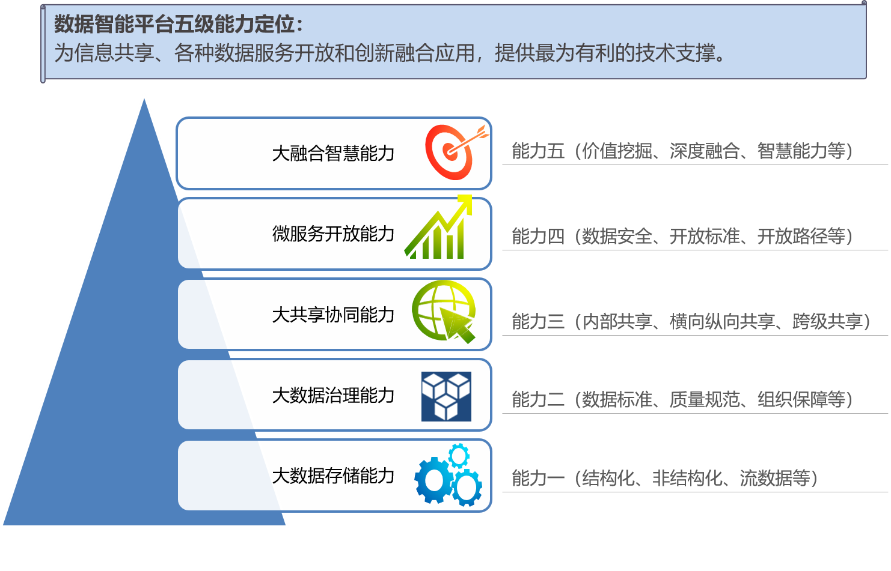
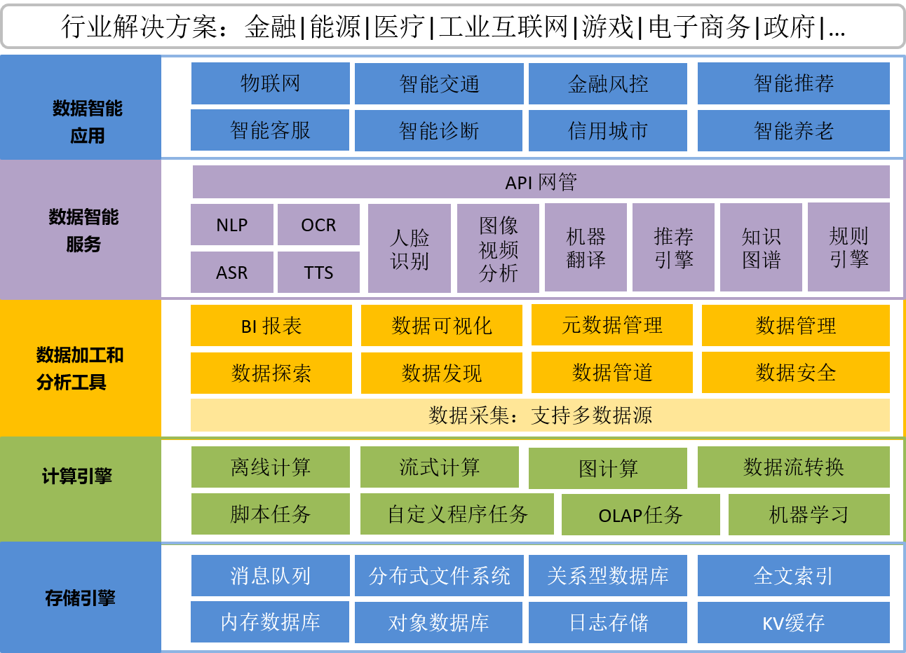
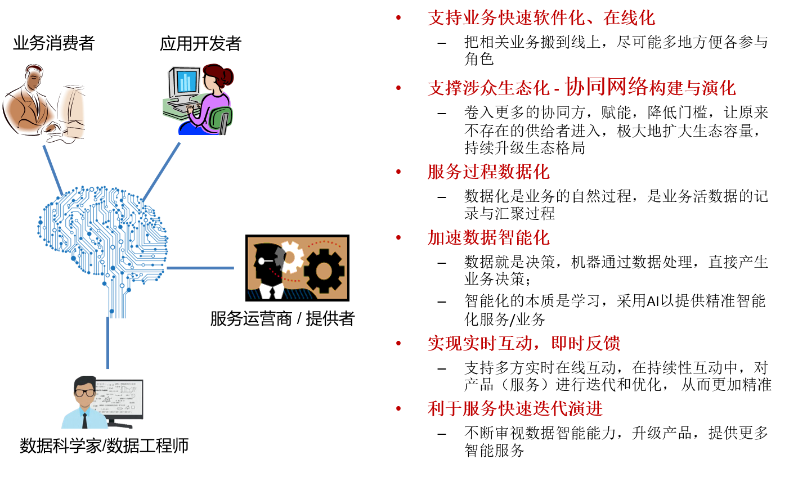
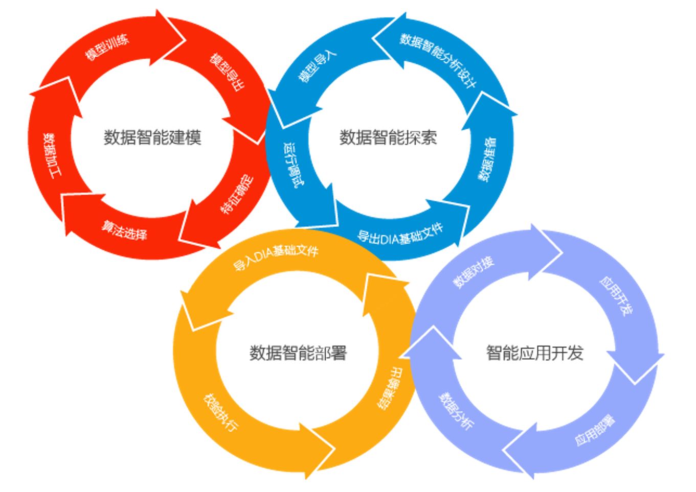

大数据智能综合治理平台能力模型
============

能力模型
---------------

    数据智能平台五级能力迭代模型

数据智能平台功能架构
----------

    数据智能平台功能架构图

核心特点
---------------

大数据智能综合治理平台完全面向数智应用开发、测试和部署，具有四大核心特点：

* 内嵌支撑人工智能引擎，支持模型构建、测试、导出、导入、服务部署等全生命周期管理。

* 内嵌支撑面向大数据的分析与处理引擎，支持端到端的典型数据流程 – 数据应用的快速开发。

* 支持数据探索、数据模型构建、数据应用快速生成与云部署运行。

* 易于构建面向服务提供商、服务运营商、数智应用开发者，以及业务消费者的生态体系，参见下图。

    基于大数据智能综合治理平台（数智大脑）的生态体系

平台上下文相关角色
------------

由上图可以看出，平台上下文的相关角色包括：服务消费者、数智应用开发者、服务
运营者/提供者、数据科学家/数据工程师。

服务消费者
***********

服务消费者是指这样一类组织、个人或 IT 系统，该组织/个人/IT 系统消费由平台提供
的业务服务组成。一般来说，服务消费者可以通过数智大脑的两种形式接口进行赋能：
1）用户图形化界面，以web页面形式；2）API（应用程序接口），以Restful API形式提供。

数智应用开发者
**********

数智应用开发者负责开发和创建一个平台增值业务应用，该增值业务应用可以托管在云
平台运营管理者环境内运行，或者由服务消费者来运行。典型场景下云应用开发者依托于平
台的 API 能力进行增值业务的开发。云业务开发者全程负责增值业务的设计、部署并维护
运行时主体功能及其相关的管理功能。如同业务消费者以及业务运营提供者一样，业务开发
者也可以是一个组织或者个人，比如一个开发业务的开发商是一个业务开发者，其内部可能
包含了上百个担任不同细分技术或商业角色的雇员。另外，负责业务管理的运维管理人员与
负责开发业务的开发组织紧密集成也是一种常见的角色组织模式，这是提升业务发放和上线
效率的一种行之有效的措施，因为此类角色合一的模式提供了更短的问题反馈路径，使得业
务的运营效率有了进一步实质性提升。

服务运营者/提供者
***********

服务运营者/提供者承担着向服务消费者提供服务的角色，并在此基础上加入增值，并
将增值后的服务对外提供。当然，服务运营者组织内部不排除有业务开发者的可能性，这两
类决策既可在同一组织内共存，也可相对独立进行。

数据科学家/数据工程师
*************

数据科学家和数据工程师可以在平台中进行数据导入、探索、清洗、发现、建模、按照
业务拼接数智神经元等工作为数据大脑构建服务业务的认知单元提供智力支撑。同时，数据
科学家和数据工程师可根据组织业务定制开发自己的数智神经元并导入到平台中， 以构建并
帮助组织完善基于自身业务的数智大脑。

基于数智大脑的数智应用开发方法论
---------------------------

基于平台进行数智应用进行开发主要包括四大组成部分，1）数据智能探索发现、2）数据智能
建模、3）数据智能服务部署和数据智能应用开发。相互关系如下。

    基于数智大脑的数智应用开发方法论

