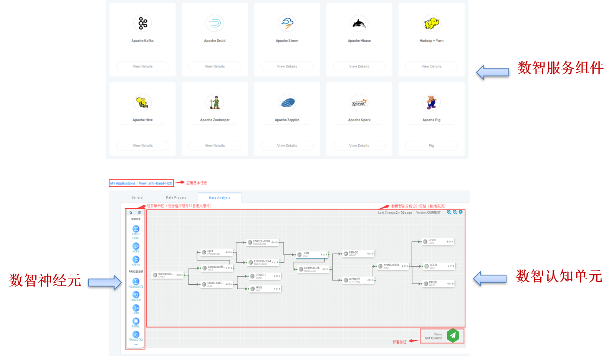

大数据智能综合治理平台
=============

大数据智能综合治理平台是一站式大数据智能综合治理系统，构架于服务器、存储、网
络等基础硬件资源和单机操作系统、中间件、数据库、大数据工具、人工智能工具等软件之
上的大数据智能综合治理系统。该平台将硬件资源逻辑上整合成一台超级服务器，为上层数
智应用提供统一、标准的接口，提供数据智能探索发现、数据智能建模、数据智能部署和数
据智能应用开发等功能。

概念与术语
------------

相关的核心概念包括：数智大脑、数智基础服务组件、数智应用服务、数智探索单元、
数智认知单元、数智探索神经元、数智认知神经元。

我们将上文中提及的基础服务组件称为“数智基础服务组件”，将这种在数智大脑中构
建的应用服务称为“数智应用服务”。“数智应用服务”包括“数智探索单元”和“数智
认知单元”。而“数智探索单元”和“数智认知单元”都是通过处理组件“神经元”拼接
构成。我们将这些处理组件按照数据功能细分为三类：1）源组件，2）处理组件，3）宿组
件。平台提供了缺省的处理组件，也支撑处理组件的定制化开发和处理组件的导入、导出。
我们也统称这些处理组件为“数智神经元”。这些概念之间的关系可参见下图。

    数智大脑核心概念关系图

综上所述，我们可以看出整个大数据智能平台即一个面向大数据人工智能分析处理的类
脑平台，也即“数智大脑”。该“数智大脑”由基本的“数智基础服务组件”和运行引擎组
成。在“数智大脑”中，多个“数智神经元”拼接形成一个个“数智认知单元”，以提供数
智应用服务，实现大脑对外的赋能能力构建。

    核心概念系统展示图

数智基础服务
-------------------

数智基础服务组件为数智大脑构建数据智能应用服务提供了基础功能。 数智大脑的核
心服务组件架构图如下所示。

    基础服务组件架构示意图

本架构采用了低耦合、开发式架构，各个基础服务组件可以按照业务需求进行添加和删
除。同时由于其开放性，平台可以便捷加入具有不同特性的大数据、人工智能、区块链等服
务组件。数智大脑采用核心流引擎将各基础服务组件提供的功能进行组合、拼接、测试、部
署以提供数智应用服务，满足不同业务的服务构建需求。参见下图。

.. figure:: ./images/streaming.png
    :width: 700px
    :align: center
    :height: 500px
    :alt: alternate text
    :figclass: align-center

    端到端的典型数据流示意图

下面对数智大脑中采用的数智基础服务组件进行一一介绍。

DATA PREPROCESSOR (NIFI)
**************************

DataBrainOS Data Preprocessor 用于构建 **数智探索单元**，进行数据清洗、转换、数智
探索和发现等任务。DataBrainOS Data Preprocessor 采用可视化配置方式，实现接入数据
源(如物联网、传感器、交易系统等)，进行数据的清洗、汇合及整理等，为后续分析的准确
性提供保障。下图是一个典型的 Data Preprocessor 操作界面，其中是数智探索单元。
注：DataBrainOS Data Preprocessor在Apache NiFi基础上改造形成。
更多Apache NiFi信息请参见 [NIFI]_ 。

.. figure:: ./images/NIFI.PNG
    :width: 600px
    :align: center
    :height: 400px
    :alt: alternate text
    :figclass: align-center

    Data Preprocessor 界面

DATA ANALYZER (DIFlow)
**************************

Data Analyzer 负责数据智能分析，用于构建 **数智认知单元** ，支持图形化拖拽。Data
Analyzer 提供了大量通用组件，方便用户直接使用，用户也可以根据需求和平台规范上传
自定义组件，以满足各种开发需求。Data Analyzer 支持模型的无缝接入，能借助模型实时
对流数据进行预测。Data Analyzer 采用分布式实时大数据处理系统，保证了分析效率，为
用户提供流畅的数据分析体验。下图是一个典型的 Data Analyzer 操作界面，其中是数智认
知单元。

.. figure:: ./images/flow.jpg
    :width: 600px
    :align: center
    :height: 400px
    :alt: alternate text
    :figclass: align-center

    Data Analyzer 界面

APACHE HADOOP
*************************

DataBrainOS 应用 Apache Hadoop 2.7 开发，以 HDFS 作为数据存储系统，Hadoop
是一个高容错、高延时的分布式文件系统和高并发的批处理系统，用于高可靠、可扩展、分
布式计算的开源软件，它允许通过集群的方式使用简单的编程模型分布式处理大数据，它可
以从单一的服务器扩展到成千上万的机器，每一台机器都能提供本地计算和存储。由 HDFS
保证期高容错性。建立了安全、稳定的大数据存储系统。

APACHE HBASE
**************************

DataBrainOS 基于 HBase 更好的实现了数据的实时计算与随机访问。 HBase 是一种构
建在 HDFS 之上的分布式、面向列的存储系统。HBase 是可以提供实时计算的分布式数据
库，数据被保存在 HDFS 分布式文件系统上，适用于实时读写、随机访问超大规模数据集。

APACHE ZOOKEEPER
****************************

Zookeeper 服务是 Hadoop 的一个子项目，由一个服务器集群来提供，以避免单点故障；
Strom、 Kafka 需要通过 ZooKeeper 管理分布式集群环境和集群状态，因此集成 Zookeeper
是不可或缺的。Zookeeper 是一个高性能的分布式系统的协调服务。它在一个简单的接口里
暴露公共服务：像命名、配置管理、同步、和群组服务，所以你没有必要从头开始实现它们。
用户可以使用现成的 Zookeeper 去实现共识、群组管理、领导人选举和业务协议，并且可
以在它的基础之上建立自己特定的需求。

APACHE STORM
***************************

由于 Storm 更加适用于实时数据流，因此为方便用户开发，提供此服务。可以使用 Storm
并行地对实时数据执行各种操作。Storm 是一个分布式实时大数据处理系统，可以方便地
处理海量数据，具有高可靠、高容错、高扩展的特点。Storm 是流式框架，有很高的数据
吞吐能力，Strom 本身是无状态的，通过 ZooKeeper 管理分布式集群环境和集群状态。
Apache Storm 是一个分布式实时大数据处理系统。

APACHE KAFKA
*******************

DataBrainOS 在 Apache Kafka 的基础上添加了大量安全特性；整合 Kerberos 以保护
数据；允许 Producer 和 Consumer 使用不同对的 KDC 来进行交叉认证；通过支持认证命
令行简化操作。它与 Apache Storm 和 Spark 完美结合，实时流式传输数据分析。Apache
Kafka 是分布式发布订阅消息传递系统和强大的队列，可以处理大量数据，并能够将消息从
一个端点传递到另一个终端。Kafka 适用于离线和在线消息消费。Kafka 建立在 ZooKeeper
同步服务之上，消息被保留在磁盘上，并在集群内复制以防止数据丢失。

DataBrainOS 集成可视化的 Kafka 管理工具 kafka manager，支持创建和管理用户各
自的 topic。

APACHE DRUID
*************

Druid 是一个用于大数据实时查询和分析的高容错、高性能开源分布式系统，旨在快速
处理大规模的数据，并能够实现快速查询和分析。尤其是当发生代码部署、机器故障以及其
他产品系统遇到宕机等情况时，Druid 仍能够保持 100%正常运行。Druid 提供了以交互方
式访问数据的能力，并权衡了查询的灵活性和性能而采取了特殊的存储格式。

APACHE ZEPPELIN
***********

强大的数据分析可视化工具。Apache Zeppelin 是一款大数据分析和可视化工具，可以
让数据分析师在一个基于 Web 页面的笔记本中，使用不同的语言，对不同数据源中的数据
进行交互式分析，并对分析结果进行可视化的工具。将数据以表格或图表的形式呈现出来，
帮助用户进行大数据挖掘工作。

SUPERSET
*****************

Superset 是一个开源的数据挖掘与可视化平台，快速创建可交互的、直观形象的数据
集合；有丰富的可视化方法来分析数据，且具有灵活的扩展能力。为大数据分析工程师，提
供更加直观的数据分析。

Superset 和 Apache Zeppelin 一起构成了 DataBrainOS 的核心 BI 和报表工具。

APACHE SPARK
********************

Spark 是基于内存计算的大数据分布式计算框架。基于内存计算，提高了在大数据环境
下数据处理的实时性，同时保证了高容错性和高可伸缩性，允许用户将 Spark 部署在大量
普通硬件之上，并形成集群。此外，Spark 可以非常方便地与其他的开源产品进行融合。
作为它的资源管理和调度器，并且可以处理所有 Hadoop 支持的数据， 包括 HDFS 、
HBase 和 Cassandra 等。这对于已经部署 Hadoop 集群不需要做任何数据迁移就可以使
用 Spark 的强大处理能力。

HUE
*******************

Hue 是 Cloudera 的大数据 Web 工具，是一个开源的 Apache Hadoop UI 系统。通
过 HUE 可以很方便的浏览 HDFS 中的目录和文件，并且进行文件和目录的创建、复制、删
除、下载以及修改权限等操作；HUE 还提供友好方便的 Hive 查询功能，能够选择不同的
Hive 数据库，编写 HQL 语句，提交查询任务，并且能够在界面下方看到查询作业运行的日
志。在得到结果后，还提供进行简单的图表分析能力； Hue 同样可以操作 HBase，
包括创建，删除，批量导入等基本功能。

ELASTICSEARCH
***************************

Elasticsearch 是一个开源的高扩展的分布式全文检索引擎，可以实时的存储、检索数
据，拥有良好对的扩展性，并且能够处理 PB 级别的数据。Elasticsearch 的底层是开源库
Lucene，是 Lucene 的封装，提供了 REST API 的操作接口，让全文搜索变得简单。

APACHE SOLR
**********************

Apache Solr 是一个可伸缩性的、能够即时部署的、致力于信息检索的、可以处理海量
信息的、以处理自然语言文本为中心的、检索结果按相关性排序的企业级搜索引擎。Solr
是一个基于 Lucene 的 Java 搜索引擎服务器，Solr 继承了 Lucene 的全部优点，并且可以
部署在多服务器上。当并发量增加时，通过 solr 的缓存组件和多核（multicore）机制向外
扩展，可以帮助企业轻松应对这种变化带来的压力。

AI MANAGER
*************************

自主开发的拥有权限控制的 AI 管理系统，对工业生产线上的机器学习模型进行训练、
管理、部署、与预测，解决了从生产到工业应用的一站式操作。并且拥有权限控制功能，不
同用户使用同一套系统，权限不同功能不同，提供 AI 管理平台。

API MANAGER
***********************

API manager 提供一个接口发布和订阅的平台，开发人员将自己开发的接口上传到平
台，通过发布按钮将接口发布到平台。接口调用者可以访问平台查看已发布的接口，并根据
自己的需求订阅接口。

SCHEMA REGISTRY
***********************

元数据是关于数据的组织、数据域及其关系的信息，为描述数据的数据。
在DataBrainOS中，为允许各类组件之间相互的灵活交互，Schema Registry提供了用于共享Schema的存储，
以有效管理各种服务组件、数智应用服务、以及数智应用之间交互的数据抽象，也即元数据（Schema）。

基于DataBrainOS构建的数智服务和数智应用通常需要一种共享元数据的方式，
同时需要根据服务和应用演进对元数据的版本进行维护和管理，
以便消费者和生产者可以理解这些元数据的不同版本且仍可读取不同版本之间共享的所有信息。

因此，Schema Registry为数智大脑提供一种集中管理元数据的机制：

- 集中式注册表 - 提供可重用的Schema，以避免将元数据附加到每个数据
- 版本管理 - 定义元数据版本之间的关系，以便消费者和生产者可以以不同的情况演进
- 元数据验证 - 确保通用格式转换，基于元数据的数据质量检验

数智应用服务
--------------------------

人类大脑之所以强大在于具有学习能力，以及可以增加新的认知能力。相比较于人类大
脑，数智大脑中的认知能力是通过不断进行数据探索、发现并最终构建新的数智认知单元形
成的。

上文中提及的基础服务组件称为“数智基础服务组件”，将这种在数智大脑中构建的应
用服务称为“数智应用服务”。“数智应用服务”包括“数智探索单元”和“数智认知单
元”，参见下图。

.. figure:: ./images/application.jpg
    :width: 600px
    :align: center
    :height: 400px
    :alt: alternate text
    :figclass: align-center

    数智应用服务

图中，“Data Prepare”标签页对应了“数智探索单元”，“Data Analysis”则对应
了“数智认知单元”。

而“数智探索单元”和“数智认知单元”都是通过处理组件“神经元”拼接构成。

数智探索单元
*******************

DataBrainOS Data Preprocessor 用于构建数智探索单元，进行数据清洗、转换、数智
探索和发现等任务。DataBrainOS Data Preprocessor 采用可视化配置方式，实现接入数据
源(如物联网、传感器、交易系统等)，进行数据的清洗、汇合及整理等，为后续分析的准确
性提供保障。下图是一个典型的 Data Preprocessor 操作界面，其中是数智探索单元。

.. figure:: ./images/NIFI.PNG
    :width: 600px
    :align: center
    :height: 400px
    :alt: alternate text
    :figclass: align-center

    数智探索单元

上图中，我们看到数据探索和发现需要多种“数智探索神经元”参与以完成针对特定数
据的特定探索发现任务。

数智认知单元
******************

人类大脑之所以强大在于具有学习能力，及增加新的认知能力。相比较于人类大脑，数
智大脑中的认知能力是通过不断构建新的数智认知单元形成的。用计算机语言说，数智认知
单元就是平台中运行的数据智能应用服务程序单元。在平台中，这种单元由三个部分组成：
1、单元描述部，2、数据探索和发现部，3、数智认知部。参见下图。

.. figure:: ./images/application.jpg
    :width: 600px
    :align: center
    :height: 400px
    :alt: alternate text
    :figclass: align-center

    数智认知单元

数智认知神经元
*****************

在经过数据探索和发现后， 需要进行构建数智认知神经元用于直接处理所有接入数据并
进行数据处理并存储，并最终服务于最终的决策和展现。参见下图。

.. figure:: ./images/flow.jpg
    :width: 600px
    :align: center
    :height: 400px
    :alt: alternate text
    :figclass: align-center

    数智认知神经元

