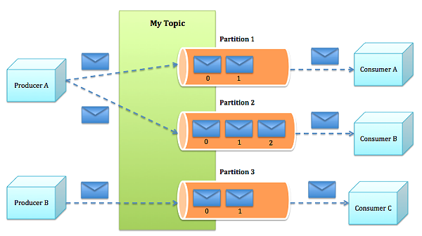

数智基础服务： **Apache Kafka** 
==============

Apache Kafka是分布式发布-订阅消息系统。它最初由LinkedIn公司开发，之后成为Apache项目的一部分。
Kafka是一种快速、可扩展的、可持久化、设计内在就是分布式的，分区的和可复制的提交日志服务。

Apache Kafka与传统消息系统相比，有以下不同：

它被设计为一个分布式系统，易于向外扩展；
它同时为发布和订阅提供高吞吐量；
它支持多订阅者，当失败时能自动平衡消费者；
它将消息持久化到磁盘，因此可用于批量消费，例如ETL，以及实时应用程序。

常见用例包括：

- 流处理（Stream processing）

- 消息机制（Messaging）

- 网站行为跟踪与分析（Website activity tracking）

- 度量数据采集和监控（Metrics collection and monitoring）

- 日志汇聚（Log aggregation）

- 事件驱动（Event sourcing）

Kafka可与Apache Storm等实时流处理引擎协同进行实时数据分析。
这种消息传递和流处理技术的结合可使处理能力以线性方式扩展。

Kafka 架构
-------------------------

Kafka架构包括以下组件：

**话题（Topic）** 是特定类型的消息流。消息是字节的有效负载（Payload），
话题是消息的分类名或种子（Feed）名。

**生产者（Producer）** 是能够发布消息到话题的任何对象。

已发布的消息保存在一组服务器中，它们被称为 **代理（Broker）** 或Kafka集群。

**消费者** 可以订阅一个或多个话题，并从Broker拉数据，从而消费这些已发布的消息。

    Kafka架构示意图

Kafka代理
**************************

与其它消息系统不同，Kafka代理是无状态的。这意味着消费者必须维护已消费的状态信息。
些信息由消费者自己维护，代理完全不管。这种设计非常微妙，它本身包含了创新。

- 从代理删除消息变得很棘手，因为代理并不知道消费者是否已经使用了该消息。Kafka创新性地解决了这个问题，它将一个简单的基于时间的SLA应用于保留策略。当消息在代理中超过一定时间后，将会被自动删除。

- 这种创新设计有很大的好处，消费者可以故意倒回到老的偏移量再次消费数据。这违反了队列的常见约定，但被证明是许多消费者的基本特征。

更多信息请参见  [Kafka]_ 和 [Kafka_InfoQ]_ 。

ZooKeeper与Kafka
******************************

ZooKeeper用于管理、协调Kafka代理。每个Kafka代理都通过ZooKeeper协调其它Kafka代理。
当Kafka系统中新增了代理或者某个代理故障失效时，ZooKeeper服务将通知生产者和消费者。
生产者和消费者据此开始与其它代理协调工作。
Kafka整体系统架构如系统图所示。

    Kafka与Zookeeper关系

配置生产环境中的Kafka
-------------------------

为将Kafka应用在生产环境中，需要进行如下操作：

- 准备环境

- 为代理、生产者和消费者定制化配置

- 配置kafka的zookeeper相关配置

准备环境
***********************

影响Kafka性能主要因素包括：

- 操作系统配置

- 文件系统选择

- 磁盘驱动配置

- JVM 设置

- 以太网带宽

