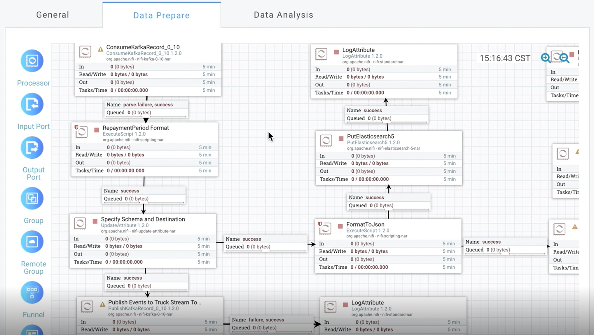

数智应用服务之 **基础** 
==============

在DataBrainOS中，我们将在数智基础服务基础上构建的应用服务称为“数智应用服务”。

数智应用服务查看
-------------

用户点击左侧菜单“My Application”，系统显示界面如下：

    数智应用服务列表

可以看到DataBrainOS中当前已构建的所有数智应用服务。

用户点击单个服务，则可以显示所选服务的详细信息。
“数智应用服务”包括 “基本信息”、“数智探索单元” 和 “数智认知单元” 三部分，参见下图。

.. figure:: ./images/application.jpg
    :width: 100%
    :align: center
    :alt: alternate text
    :figclass: align-center

    数智应用服务

图中，“General”部分对应了数智应用服务的“基本信息”，“Data Prepare”标签页对应了“数智探索单元”，而“Data Analysis”则对应
了“数智认知单元”。

- “基本信息” ： 显示了 “数智认知单元” 运行的基本性能信息，更详细的信息可以通过点击“Stop”左边的小图标查看。

- “数智探索单元” ： 支持数据清洗、转换、数智探索和发现等任务，完成数智认知学习过程。

    数智探索单元

- “数智认知单元” ： 支持直接处理所有接入数据并进行数据处理并存储，并服务于最终的决策和展现。

.. figure:: ./images/flow.jpg
    :width: 600px
    :align: center
    :height: 400px
    :alt: alternate text
    :figclass: align-center

    数智认知单元

数智应用服务创建
-----------------------

用户也可以通过点击“数智应用服务列表”上的“ADD”来创建新的“数智应用服务”，参见下图。

    创建“数智应用服务”

