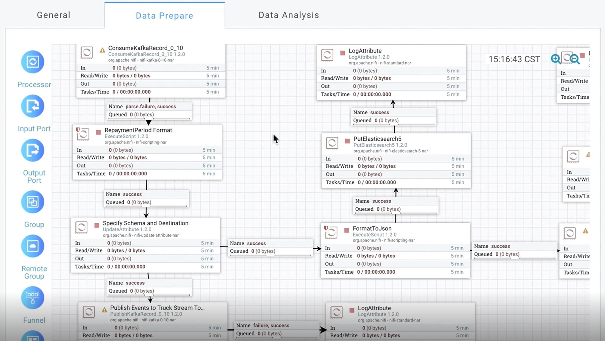
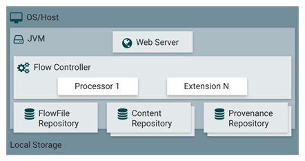
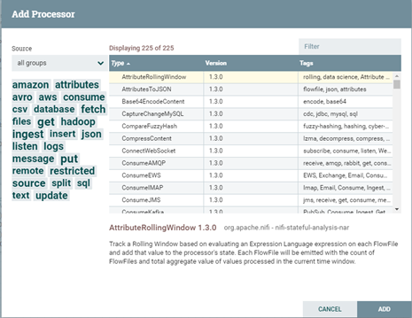
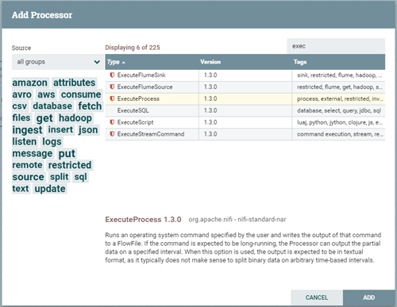
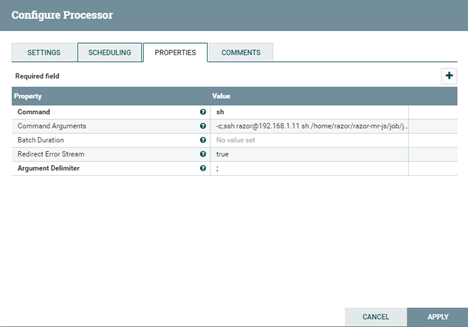
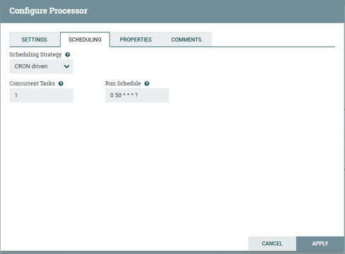
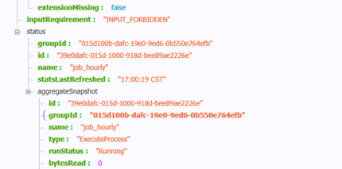

数智应用服务： **数智探索单元** 
==============

    数智探索单元

DataBrainOS Data Preprocessor用于构建数智探索单元，该组件是在Apache NiFi基础上改造形成。
NiFi是Apache支持下基于可视化流程设计的数据分发平台，是大数据的搬运、提取、推送、转换、聚合、分发的开源软件工具，
能够与Hadoop生态系统的大数据存储和各种文件、REST服务、SOAP服务、消息服务等联合使用，构成一体化的数据流服务。 
Apache NiFi详细使用手册可参见 [NIFI]_ 。

关键概念
-------------

为了使用熟练 Data Preprocessor / NiFi 以构建数智探索单元，用户需要首先了解几个关键概念。

.. csv-table:: 几个关键概念
   :header: "概念或术语", "解释"
   :widths: 100, 400
   
   "FlowFile（流文件）", "每条“用户数据”（用户带入平台进行处理和分发的数据）被称为FlowFile。 FlowFile由两部分组成：属性和内容。 内容是用户数据本身。 属性是与用户数据关联的键值对（key-value）。"
   "Processor（数智探索神经元）", "Processor是处理组件，负责创建，发送，接收，转换，路由，拆分，合并和处理FlowFiles。 它是用户可用于构建数智探索和发现单元（数据流）的最重要的构建块，在DataBrainOS中也称之为数智探索神经元。"
   "Connection（连接）", "表示Processor之间的顺序关系，也是FlowFile的内容流向，内部实现是基于Java队列机制。"
   "template（数智探索模板）", "为增加复用性，设计了模板概念和机制，即构建完成的应用或者部分模块能够导出为模板文件（xml描述文件）之后可以通过导入直接生成一个可以运行的应用。"

架构示意
----------------

为了方便用户深入理解机制，下面对服务组件的架构做简要介绍，如下图所示。

    架构示意

.. csv-table:: 架构组件介绍
   :header: "架构组件", "简要介绍"
   :widths: 100, 400
   
   "WebServer", "其目的在于提供基于HTTP的命令和控制API。"
   "Flow Controller", "这是操作的核心，以Processor为处理单元，提供了用于运行的执行引擎，并管理各种处理的调度。"
   "Extensions", "各种类型的扩展，Extensions的关键在于扩展在JVM中操作和执行。"
   "FlowFile Repository", "FlowFile库的作用是跟踪记录当前在流中处于活动状态的给定流文件的状态，其实现是可插拔的，默认的方法是位于指定磁盘分区上的一个持久的写前日志。"
   "Content Repository", "Content库的作用是给定流文件的实际内容字节所在的位置，其实现也是可插拔的。默认的方法是一种相对简单的机制，即在文件系统中存储数据块。"
   "Provenance Repository", "Provenance库是所有源数据存储的地方，支持可插拔。默认实现是使用一个或多个物理磁盘卷，在每个位置事件数据都是索引和可搜索的。"

Processor（数智探索神经元）
-------------------------

可以看出，Flow Controller扮演了文件交流的处理器角色，维持着多个处理器的连接并管理各个Processer，
Processer则是实际处理单元。

在平台中，通过Web UI可以查看提供的各种Processor（数智探索神经元）。

    Processor（数智探索神经元）

如上图所示，Processor包含各种类型的组件，如amazon、attributes、hadoop等，可通过前缀进行轻易辨识，如Get、Fetch开头代表获取，
如getFile、getFTP、FetchHDFS，execute代表执行，如ExecuteSQL、ExecuteProcess、ExecuteFlumeSink等均可较容易知其简单用途。
用户可以在右上角Filter文本框中输入信息过滤得到相关的Processor。

一个简单的Processor实例
---------------------

需求用例如下：

  ::

    选取一款数据处理调度工具，对服务器脚本实现定时调度执行。
    其中服务器的脚本涉及到对环境变量、oracle数据库、Hadoop生态圈组件的调度。
    当对服务器脚本调度执行完成后返回脚本运行状态，并提供失败重运行接口。

在此，我们使用ExecuteProcess作为具体的processor。具体操作如下。

Processor的添加与配置
**********************

1. 点击“Add Processor”，选择ExecuteProcess后点击Add按钮完成添加，如下图。

    ExecuteProcess

2. 右击ExecuteProcess后选择Configure Processor，对Properties选项卡进行配置，其中每一个配置选项均提供了相关的说明，如下图。

    ExecuteProcess的配置选项

如上图所示，这里有必要对各选项进行相关说明。

•	Command（执行命令）： sh。
•	Command Arguments（执行命令参数）：-c;ssh user@ip sh js/job/job_hourly.sh
•	Batch Duration（执行间隔时间）：不设置。// 需求是通过定时调度，而并非按间隔时间执行。
•	Redirect Error Stream（重定位流）：不设置。
•	Argument Delimiter（执行命令参数分隔符）：; // 以;作为参数的分隔符。

3. 进行调度配置

平台支持三种调度策略，包括Time Driven（时间驱动）、CRON Driven（CRON驱动）和Event Driven（事件驱动，非可选），
根据我们实际需求选择CRON Driven。CRON即是Crontab的应用，CRON的各参数含义分别代表：秒、分、时、日、月、周、年，
需要配合*、？和L共同执行（*代表字段的值都有效；?代表对于指定的字段不指定值；L代表长整形）。
如：“0 0 13 * * ?”代表想要在每天下午1点进行调度执行。因此根据我们的需求进行参数的调度配置。如下图所示。

    ExecuteProcess的调度配置

Processor的运行监控
**********************

平台提供web UI方式让用户可以直接查看Processor（神经元）的运行状态。

同时也提供开发者NiFi通过Rest API供开发者调度，这里采用Processor API对运行状态进行监控（状态参数获取）。

1.	运行状态监控参数获取：
命令如下：
  ::

    curl 'http://IP/nifi-api/processors/processorsID'
    
得到如下结果，可通过json解析器解析并获取状态。

    采用Rest API得到的监控结果（json形式）