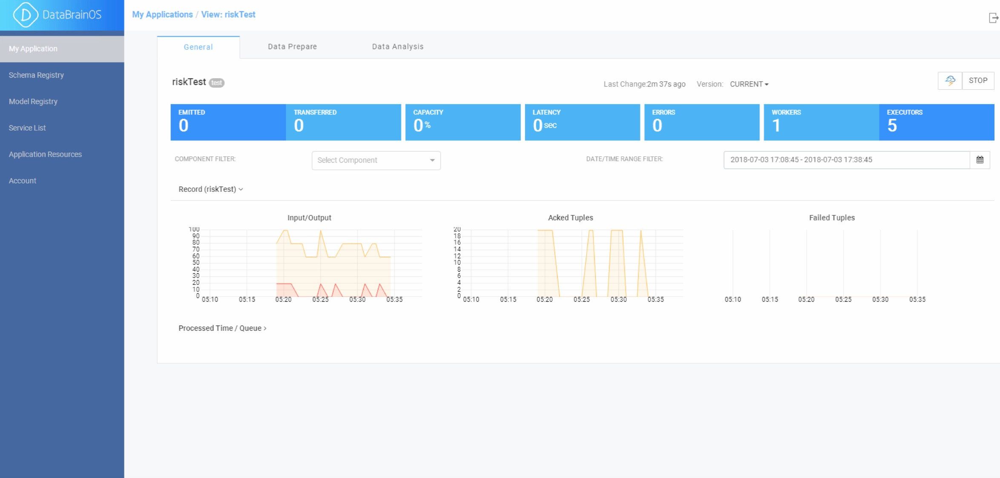

数智应用服务： **数智认知单元** 
==============

在经过数据探索和发现后， 需要进行构建数智认知神经元用于直接处理所有接入数据并
进行数据处理并存储，并最终服务于最终的决策和展现。参见下图。

.. figure:: ./images/flow.jpg
    :width: 600px
    :align: center
    :height: 400px
    :alt: alternate text
    :figclass: align-center

    数智认知单元

创建数智认知单元
---------------

“数智应用服务”由三个部分组成：
1、基本信息，2、数智探索单元，3、数智认知单元。参见下图。

    数智应用服务

只需要创建数智应用服务就创建了所包含的数智认知单元。

用户点击左侧菜单栏的“My Application”菜单项，平台显示数智应用服务列表，参见下图。

    数智应用服务列表

用户点击右上角的“ADD”按钮，平台显示添加数智应用服务对话框，参见下图。

    创建数智应用服务

在生成数智应用服务后，用户点击“Data Analysis”标签，
平台显示出数智认知单元编辑页面。

    数智认知单元编辑页面

编辑页面中包括了图形化组件部分，我们也称之为认知神经元，
用户可以在编辑界面中图形编辑区中通过拖拽组件、连接组件及配置以形成数智认知单元。

添加信源（Source）神经元
-------------

用户拖拽信源（Source）神经元到图形编辑区。
此处用Kafka源为例，参见下图。

    Kafka源神经元及配置

添加处理（PROCESSOR）神经元
-------------

用户可以拖拽处理（PROCESSOR）神经元到图形编辑区。
用户也可以使用自定义的处理神经元，如何创建自定义处理神经元在后文中进行描述。

同样，用户需要对相关神经元进行配置。

连接神经元
-------------

添加并配置源神经元后，将其他处理神经元和信宿神经元添加到编辑区中。 
要将数据流从一个神经元传递到下一个神经元，必须在两个神经元之间创建连接。 
除了定义数据流之外，连接还允许用户将元数据从一个神经元到另一个神经元。

添加信宿（Sink）神经元
-------------

基本操作如其他神经元，但此类神经元没有输出，只能从其他神经元连入，不能连出。
如下图中的DRUID和HBASE信宿神经元。

    各类认知神经元及连接

部署运行数智认知单元
-------------

进行部署设置
****************

在部署数智应用服务之前，配置部署设置非常重要，例如JVM大小，
ackers数量和worker的数量。 对于负责数智应用服务的设计可能会使用多个连接和窗口，
因此应增加工作线程的JVM堆大小。单击编辑区域右上角的齿轮图标，
增加worker数量（例如：5）并增加JVM堆内存（-Xmx3072m）。

    部署配置 - 基本配置

同时，需要进行安全性设置，参见下图。

    部署配置 - 安全配置

部署数智应用服务
*******************

在完成数智应用服务部署的配置设定后，单击编辑区域右下角的“部署”按钮。 在部署过程中，平台完成以下任务：

- 使用配置将服务进行打包，形成可部署在后台流处理引擎上运行的应用程序 - jar包。
- 将jar上传并部署到流引擎服务集群上。
- 启动数智应用服务

    部署过程

监控数智认知单元运行状态
-------------

已部署数智认知单元运行在Storm集群上，所以我们可以采用Storm UI监控所有部署节点的运行情况。
参见下图：

    采用Storm UI监控数智认知单元运行状态

其中用户可以重点关注监控界面中显示的关键度量指标以发现性能上的瓶颈节点（神经元）。
关键度量及解释可参见下表。

.. csv-table:: 关键度量及解释
   :header: "度量", "解释"
   :widths: 100, 500

   "Execute Latency", "指定神经元处理数据所需的平均时间"
   "Process Latency", "数据被确认的平均时间。在收到其他神经元数据之前，加入，聚合或批量处理的神经元不会进行确认，直至所有数据完备。"
   "Complete Latency", "来自信源神经元的数据需要多长时间才能被整个认知单元完全处理和确认。 此指标仅适用于来信源神经元（例如：Kafka Source）"
   "Emitted", "在给定时间段内发出的tuple数。 例如，对于Kafka信源神经元，它是给定时间段内消耗的tuple数"
   "Acked", "在给定时间段内执行并确认的tuple数。 例如，对于Kafka源，它是处理的tuple数然后被确认"

