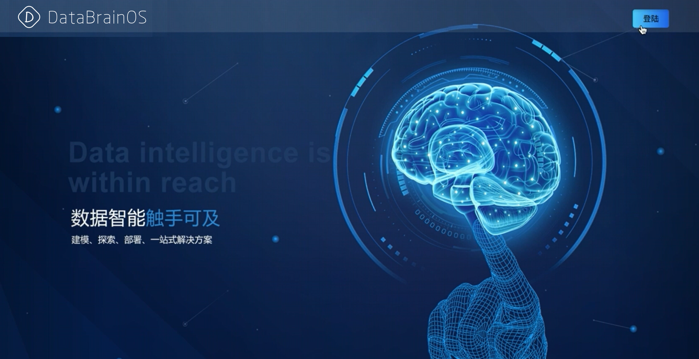

==================================================
欢迎访问数智大脑（DataBrainOS）文档!
==================================================

欢迎来到DataBrainOS文档站点！您可根据自己的兴趣从侧栏选择学习路径，或查看下面的完整内容大纲。

我们很高兴您有兴趣了解更多有关DataBrainOS的信息。 如果您有任何问题或想法要分享，请将它们以Issue的形式发布到我们的 `Github网站 <https://github.com/hawkwang/template/issues>`_ 上。

    

用户文档
---------------

.. toctree::
   :maxdepth: 2
   :glob:

   chapter-1

.. toctree::
   :maxdepth: 2
   :glob:

   chapter-2

.. toctree::
   :maxdepth: 2
   :glob:

   chapter-3

.. toctree::
   :maxdepth: 2
   :glob:

   chapter-5-1

.. toctree::
   :maxdepth: 2
   :glob:

   chapter-4-1

.. toctree::
   :maxdepth: 2
   :glob:

   chapter-4-2

.. toctree::
   :maxdepth: 2
   :glob:

   chapter-4-3

.. toctree::
   :maxdepth: 2
   :glob:

   chapter-4-4

.. toctree::
   :maxdepth: 2
   :glob:

   chapter-4-5

.. toctree::
   :maxdepth: 2
   :glob:

   zappendix-X

.. toctree::
   :maxdepth: 2
   :glob:

   zappendix-Y

.. toctree::
   :maxdepth: 2
   :glob:

   zappendix-Z

