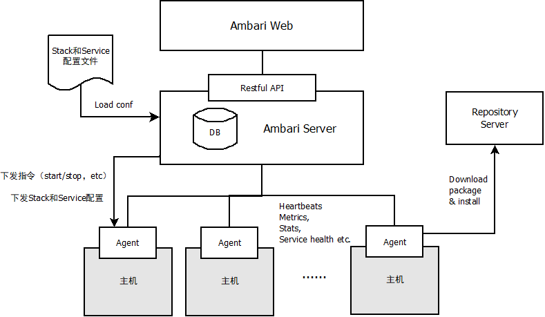

附录A：基础组件之 **Apache Ambari** 
==============

Apache Ambari是一种基于Web的工具，支持Apache Hadoop集群的供应、管理和监控。
Ambari已支持大多数Hadoop组件，包括HDFS、MapReduce、Hive、Pig、 Hbase、Zookeeper、Sqoop和Hcatalog等。

Ambari主要具有以下特性：

- 通过一步一步的安装向导简化了集群供应。

- 预先配置好关键的运维指标（metrics），可以直接查看Hadoop Core（HDFS和MapReduce）及相关项目（如HBase、Hive和HCatalog）是否健康。

- 支持作业与任务执行的可视化与分析，能够更好地查看依赖和性能。

- 通过一个完整的RESTful API把监控信息暴露出来，集成了现有的运维工具。

- 用户界面非常直观，用户可以轻松有效地查看信息并控制集群。

- Ambari使用Ganglia收集度量指标，用Nagios支持系统报警，当需要引起管理员的关注时（比如，节点停机或磁盘剩余空间不足等问题），系统将向其发送邮件。

- 此外，Ambari能够安装安全的（基于Kerberos）Hadoop集群，以此实现了对Hadoop 安全的支持，提供了基于角色的用户认证、授权和审计功能，并为用户管理集成了LDAP和Active Directory。

下图为Ambari的架构图：

    Ambari 架构图

