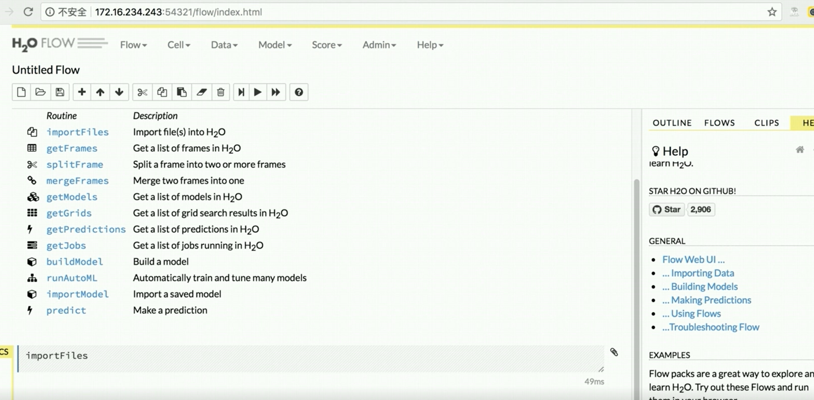
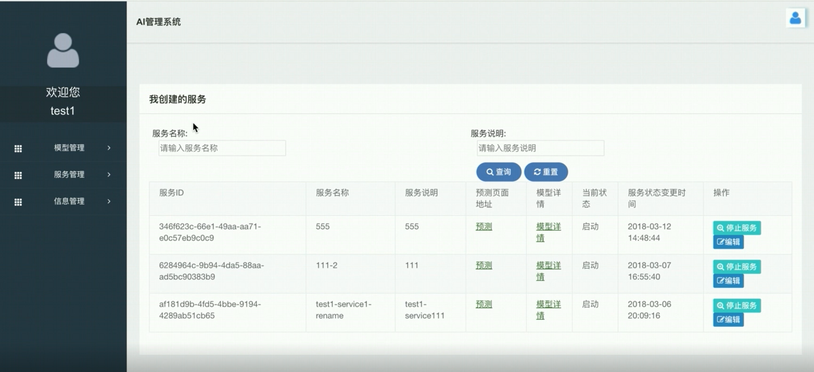

附录E：基础组件之 **H2O** 
==============

H2O是一个开源的分布式可伸缩性的大数据机器学习平台，主要服务于数据科学家、商业分析师、开发者，为其应用提供快速机器学习引擎。
除了开源平台，H2O.ai 同时也提供一系列的辅助工具，包括 Sparking Water，
后者整合了 Apache Spark 数据处理引擎。
另外还有 Flow，一款针对 H2O 的笔记本风格开源 UI，类似 iPython 笔记本。

在DataBrainOS中，为了方便用户方便使用H2O，平台将H2O Flow进行了整合并推出了AI manager管理训练得到的各种模型。

H2O Flow
---------------------

H2O Flow是H2O的开源用户界面。它是一个基于Web的交互式环境，允许您将代码执行，文本，数学，绘图和富媒体组合在一个文档中。

使用H2O Flow，您可以捕获，重新运行，注释，呈现和共享您的工作流程。 H2O Flow允许您以交互方式使用H2O导入文件，构建模型并迭代地改进它们。根据您的模型，您可以进行在线预测 - 所有这些都在Flow的基于浏览器的环境中。

Flow的混合用户界面将命令行计算与现代图形用户界面无缝融合。但是，Flow不是将输出显示为纯文本，而是为每个H2O操作提供可操作的用户界面。它允许您以组织良好的表格数据的形式访问任何H2O对象。

H2O Flow将命令作为可执行单元序列发送到H2O。可以修改，重新排列单元格或将其保存到库中。每个单元格都包含一个输入字段，允许您输入命令，定义函数，调用其他函数以及访问页面上的其他单元格或对象。执行单元格时，输出是一个图形对象，可以检查该对象以查看其他详细信息。

同时H2O Flow支持REST API，但运行H2O Flow不需要编程经验。您可以通过任何界面操作H2O命令，而无需编写任何代码。H2O Flow旨在通过提供输入提示，交互式帮助和示例流程来指导您的每一步。

AI Manager
-------------------

AI Manager 用于管理管理H2O Flow创建的各种模型，主要包括如下功能：

- 导入已经生成的模型（POJO、JAR包、WAR包等）

- 将导入的模型部署启动为服务，并以Restful API接口提供各种服务

- 在线测试服务，并生成结果