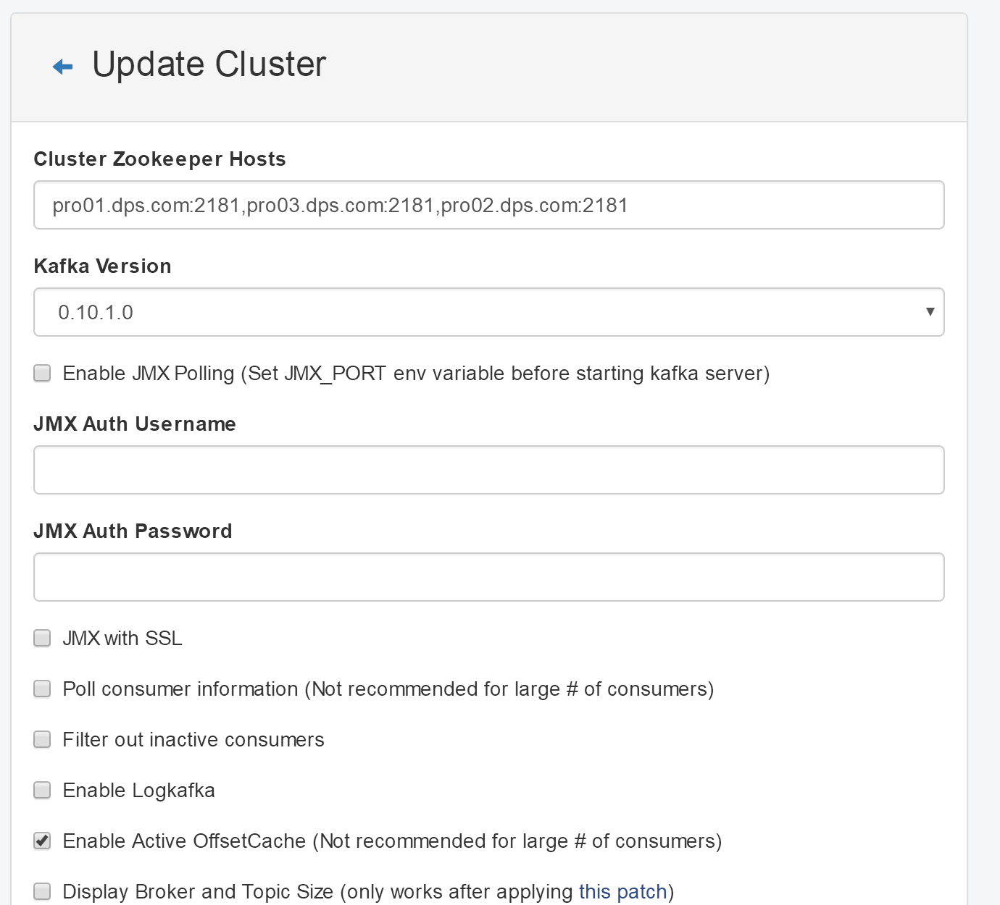

创建第一个用户
*************

- 访问 http://103.227.51.139:28080/databrain_user

- 创建用户后退出。第一个账号现在创建为dftest

- 登陆 https://103.227.51.139:9999, 如遇到问题请清缓存重试

准备项目环境
**************

- 访问https://103.227.51.139:9999/#/service-pool，添加集群地址，见下图

.. figure:: ./images/installation/env-1.png
    :width: 550px
    :align: center
    :alt: alternate text
    :figclass: align-center

- 点击“AUTO ADD”，在对话框中填写Ambari的管理员账号和密码，如下图。

.. figure:: ./images/installation/env-2.png
    :width: 550px
    :align: center
    :alt: alternate text
    :figclass: align-center

- 点击“OK”，获得出平台服务

.. figure:: ./images/installation/env-3.png
    :width: 550px
    :align: center
    :alt: alternate text
    :figclass: align-center

- 打开链接： https://103.227.51.139:9999/#/environments ，点击“ADD”

.. figure:: ./images/installation/env-4.png
    :width: 550px
    :align: center
    :alt: alternate text
    :figclass: align-center

- 选择服务，构建项目环境

.. figure:: ./images/installation/env-5.png
    :width: 550px
    :align: center
    :alt: alternate text
    :figclass: align-center

- 配置 kafka manager，打开 http://103.227.51.139:9307/

.. figure:: ./images/installation/kafka-1.png
    :width: 550px
    :align: center
    :alt: alternate text
    :figclass: align-center

- 点击“Add Cluster”，进行设置，并保存配置

  ::
    
    Cluster Name： cf
    Cluster Zookeeper Hosts： pro01.dps.com:2181,pro03.dps.com:2181,pro02.dps.com:2181
    Kafka Version：0.10.1.0
    Enable Active OffsetCache (Not recommended for large # of consumers) : checked
    Security Protocol：SASL_PLAINTEXT

创建平台用户
************

