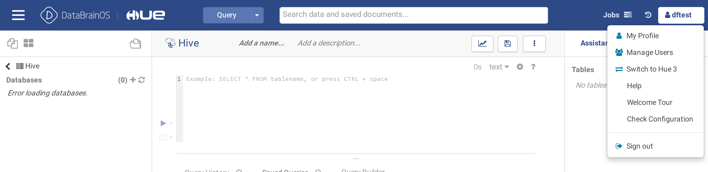

创建第一个用户
*************

- 访问 http://103.227.51.139:28080/databrain_user

- 创建用户后退出。第一个账号现在创建为dftest

- 登陆 https://103.227.51.139:9999, 如遇到问题请清缓存重试

准备项目环境
**************

- 访问https://103.227.51.139:9999/#/service-pool，添加集群地址，见下图

.. figure:: ./images/installation/env-1.png
    :width: 550px
    :align: center
    :alt: alternate text
    :figclass: align-center

- 点击“AUTO ADD”，在对话框中填写Ambari的管理员账号和密码，如下图。

- 点击“OK”，获得出平台服务

- 打开链接： https://103.227.51.139:9999/#/environments ，点击“ADD”

.. figure:: ./images/installation/env-4.png
    :width: 550px
    :align: center
    :alt: alternate text
    :figclass: align-center

- 选择服务，构建项目环境

.. figure:: ./images/installation/env-5.png
    :width: 550px
    :align: center
    :alt: alternate text
    :figclass: align-center

- 配置 kafka manager，打开 http://103.227.51.139:9307/

.. figure:: ./images/installation/kafka-1.png
    :width: 550px
    :align: center
    :alt: alternate text
    :figclass: align-center

- 点击“Add Cluster”，进行设置，并保存配置

  ::
    
    Cluster Name： cf
    Cluster Zookeeper Hosts： pro01.dps.com:2181,pro03.dps.com:2181,pro02.dps.com:2181
    Kafka Version：0.10.1.0
    Enable Active OffsetCache (Not recommended for large # of consumers) : checked
    Security Protocol：SASL_PLAINTEXT

创建平台用户
************

此处以用户名hawk为例子创建平台用户。

1）在kerberos中添加用户

- 在KDC服务器所在的节点执行操作 kadmin.local 进入命令行

密码是“left2rols”

2）在DataBrainOS User中添加用户，http://103.227.51.139:28080/databrain_user

此处添加的账号密码是登陆DataBrainOS UI的账号和密码

3）Ranger 配置

- 在Ambari打开所有需要的plugin

.. figure:: ./images/installation/ranger-1.png
    :width: 550px
    :align: center
    :alt: alternate text
    :figclass: align-center

- 重启受到影响的服务

- 以系统管理员身份登陆 ranger管理页面， http://103.227.51.139:6080/login.jsp 

同理可以配置其他组件。

4）在各个服务中添加用户

 - DataBrainOS UI(streamline): https://103.227.51.139:9999/#/authorizer

- NIFI

需要手写一个xml文件，登陆Nifi的服务器进行添加

  ::
    
    cd /var/lib/nifi/conf
    vi users.xml

执行

  ::
    
    vi authorizations.xml

FIXME：这种方式需要通过API调用方式改进

- Superset

访问 http://103.227.51.139:9088

必须勾选“激活”, 密码是“left2rols”

- Hue

访问 http://103.227.51.139:8888/ 

使用“Manage Users”添加用户

- AI Manager

打开 http://103.227.51.139:89

添加用户

- API Manager

https://103.227.51.139:9443/publisher/site/pages/login.jag 
  
  FIXME：现在需要进行清缓存才能登陆，admin/admin。
  API网管由于情况特殊，需要进行单独登陆。
