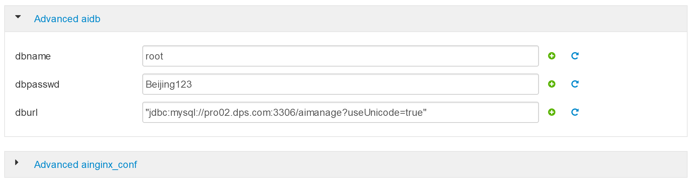

附录A：数智大脑集群安装
==============

此部分内容介绍如何安装和配置数智大脑集群。此处以5台机器为例子进行集群的安装和配置。

这个过程分为三个阶段：1）安装准备；2）安装及配置；3）运行及验证

安装准备阶段
---------------

准备好5台操作系统为Centos 7 的机器，此处为虚机。主机IP地址为103.227.51.139，端口为 20002 - 20009。

- 下载deploy_dpaas.tar.gz文件

- 复制压缩包 deploy_dpaas.tar.gz 到所有节点的 /opt目录下

- 在每台机器上解压该文件

  ::

    tar -xzvf deploy_dpaas.tar.gz

- 在node1上 执行 cd deploy_dpaas

- 在node1上执行 ./init.sh，在当前安装python等包

- 在node1上执行 python main.py change_host 改变所有待安装节点的hostname

注：

1. 节点的IP和端口配置在./shell/sys_init/IP_hosts中定义。内容参见如下:

  ::

    192.168.20.5 pro02.dps.com pro02
    192.168.20.6 pro03.dps.com pro03
    192.168.20.8 pro04.dps.com pro04
    192.168.20.9 pro05.dps.com pro05
    192.168.20.10 pro06.dps.com pro06
    192.168.20.11 pro07.dps.com pro07
    192.168.20.12 pro08.dps.com pro08
    192.168.20.2 pro01.dps.com pro01
    

2. node1配置信息需要放在最后一行，且需要回车换行形成随后的空行。

3. ./shell/sys_init/hosts.sh   中包含root密码。

4. 所有节点会重新启动

- 再次连接入node1节点

- cd /opt/deploy_dpaas

- 执行 python main.py auto_ssh， 实现所有节点相互的免密码访问。请进行ssh免密码访问验证。

- 执行 python main.py server 以安装Ambari Server和Kerberos主服务器

- 在其他所有节点上执行 init.sh

- 在这些节点上执行 python main.py agent，安装所需的agent 服务

至此，基础安装环境已经就绪。

安装及配置
---------------------

- 使用浏览器打开 url： http://103.227.51.139:8080，登陆进入主页面。

.. figure:: ./images/installation/1.png
    :width: 550px
    :align: center
    :alt: alternate text
    :figclass: align-center

.. figure:: ./images/installation/2.png
    :width: 550px
    :align: center
    :alt: alternate text
    :figclass: align-center

.. figure:: ./images/installation/4.png
    :width: 550px
    :align: center
    :alt: alternate text
    :figclass: align-center

.. figure:: ./images/installation/5.png
    :width: 550px
    :align: center
    :alt: alternate text
    :figclass: align-center

.. figure:: ./images/installation/7.png
    :width: 550px
    :align: center
    :alt: alternate text
    :figclass: align-center

.. figure:: ./images/installation/8.png
    :width: 550px
    :align: center
    :alt: alternate text
    :figclass: align-center

.. figure:: ./images/installation/13.png
    :width: 550px
    :align: center
    :alt: alternate text
    :figclass: align-center

.. figure:: ./images/installation/15.png
    :width: 550px
    :align: center
    :alt: alternate text
    :figclass: align-center

.. figure:: ./images/installation/16.png
    :width: 550px
    :align: center
    :alt: alternate text
    :figclass: align-center

.. figure:: ./images/installation/17.png
    :width: 550px
    :align: center
    :alt: alternate text
    :figclass: align-center

.. figure:: ./images/installation/18.png
    :width: 550px
    :align: center
    :alt: alternate text
    :figclass: align-center

.. figure:: ./images/installation/19.png
    :width: 550px
    :align: center
    :alt: alternate text
    :figclass: align-center

.. figure:: ./images/installation/20.png
    :width: 550px
    :align: center
    :alt: alternate text
    :figclass: align-center

.. figure:: ./images/installation/21.png
    :width: 550px
    :align: center
    :alt: alternate text
    :figclass: align-center

.. figure:: ./images/installation/22.png
    :width: 550px
    :align: center
    :alt: alternate text
    :figclass: align-center

.. figure:: ./images/installation/23.png
    :width: 550px
    :align: center
    :alt: alternate text
    :figclass: align-center

.. figure:: ./images/installation/27.png
    :width: 550px
    :align: center
    :alt: alternate text
    :figclass: align-center

.. figure:: ./images/installation/28.png
    :width: 550px
    :align: center
    :alt: alternate text
    :figclass: align-center

.. figure:: ./images/installation/29.png
    :width: 550px
    :align: center
    :alt: alternate text
    :figclass: align-center

.. figure:: ./images/installation/30.png
    :width: 550px
    :align: center
    :alt: alternate text
    :figclass: align-center

.. figure:: ./images/installation/32.png
    :width: 550px
    :align: center
    :alt: alternate text
    :figclass: align-center

.. figure:: ./images/installation/33.png
    :width: 550px
    :align: center
    :alt: alternate text
    :figclass: align-center

.. figure:: ./images/installation/34.png
    :width: 550px
    :align: center
    :alt: alternate text
    :figclass: align-center

.. figure:: ./images/installation/35.png
    :width: 550px
    :align: center
    :alt: alternate text
    :figclass: align-center

.. figure:: ./images/installation/36.png
    :width: 550px
    :align: center
    :alt: alternate text
    :figclass: align-center

.. figure:: ./images/installation/39.png
    :width: 550px
    :align: center
    :alt: alternate text
    :figclass: align-center

.. figure:: ./images/installation/40.png
    :width: 550px
    :align: center
    :alt: alternate text
    :figclass: align-center

.. figure:: ./images/installation/43.png
    :width: 550px
    :align: center
    :alt: alternate text
    :figclass: align-center

.. figure:: ./images/installation/45.png
    :width: 550px
    :align: center
    :alt: alternate text
    :figclass: align-center

.. figure:: ./images/installation/46.png
    :width: 550px
    :align: center
    :alt: alternate text
    :figclass: align-center

.. figure:: ./images/installation/47.png
    :width: 550px
    :align: center
    :alt: alternate text
    :figclass: align-center

.. figure:: ./images/installation/48.png
    :width: 550px
    :align: center
    :alt: alternate text
    :figclass: align-center

.. figure:: ./images/installation/50.png
    :width: 550px
    :align: center
    :alt: alternate text
    :figclass: align-center

.. figure:: ./images/installation/51.png
    :width: 550px
    :align: center
    :alt: alternate text
    :figclass: align-center

.. figure:: ./images/installation/52.png
    :width: 550px
    :align: center
    :alt: alternate text
    :figclass: align-center

.. figure:: ./images/installation/54.png
    :width: 550px
    :align: center
    :alt: alternate text
    :figclass: align-center

.. figure:: ./images/installation/56.png
    :width: 550px
    :align: center
    :alt: alternate text
    :figclass: align-center

.. figure:: ./images/installation/60.png
    :width: 550px
    :align: center
    :alt: alternate text
    :figclass: align-center

.. figure:: ./images/installation/62.png
    :width: 550px
    :align: center
    :alt: alternate text
    :figclass: align-center

.. figure:: ./images/installation/64.png
    :width: 550px
    :align: center
    :alt: alternate text
    :figclass: align-center

.. figure:: ./images/installation/65.png
    :width: 550px
    :align: center
    :alt: alternate text
    :figclass: align-center

.. figure:: ./images/installation/66.png
    :width: 550px
    :align: center
    :alt: alternate text
    :figclass: align-center

.. figure:: ./images/installation/69.png
    :width: 550px
    :align: center
    :alt: alternate text
    :figclass: align-center

运行及验证
---------------------

.. csv-table:: 集群物理节点角色
   :header: "物理节点角色", "是否必须", "服务器硬件配置"
   :widths: 200, 200, 200
   
   "Active NameNode", "必须", "Master"
   "Standby NameNode", "必须", "Master"
   "Data Node 1 - N", "必须", "Data"
   "High Availability (HA) Node", "必须", "Master"
   "Admin Node", "必须", "Master"
   "Edge Node 1 - N", "建议（否则服务要与其它节点公用资源）", "Master"

.. figure:: ./images/network-connections.PNG
    :width: 550px
    :align: center
    :height: 350px
    :alt: alternate text
    :figclass: align-center

    网络架构图

下表中列出了数智大脑（DataBrainOS）中运行的数智基础服务。

