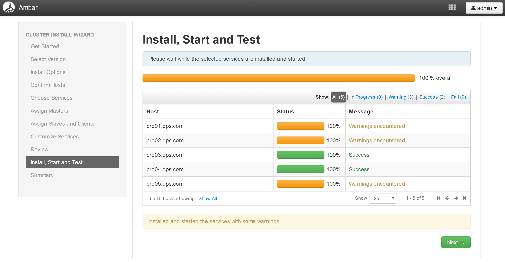
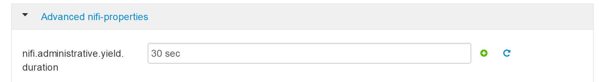

附录A：数智大脑集群安装
==============

此部分内容介绍如何安装和配置数智大脑集群。此处以5台机器为例子进行集群的安装和配置。

这个过程分为三个阶段：1）安装准备；2）安装及配置；3）运行及验证

安装准备阶段
---------------

准备好5台操作系统为Centos 7 的机器，此处为虚机。主机IP地址为103.227.51.139，端口为 20002 - 20009。

- 下载deploy_dpaas.tar.gz文件

- 复制压缩包 deploy_dpaas.tar.gz 到所有节点的 /opt目录下

- 在每台机器上解压该文件

  ::

    tar -xzvf deploy_dpaas.tar.gz

- 在node1上 执行 cd deploy_dpaas

- 在node1上执行 ./init.sh，在当前安装python等包

- 在node1上执行 python main.py change_host 改变所有待安装节点的hostname

注：

1. 节点的IP和端口配置在./shell/sys_init/IP_hosts中定义。内容参见如下:

  ::

    192.168.20.5 pro02.dps.com pro02
    192.168.20.6 pro03.dps.com pro03
    192.168.20.8 pro04.dps.com pro04
    192.168.20.9 pro05.dps.com pro05
    192.168.20.10 pro06.dps.com pro06
    192.168.20.11 pro07.dps.com pro07
    192.168.20.12 pro08.dps.com pro08
    192.168.20.2 pro01.dps.com pro01
    

2. node1配置信息需要放在最后一行，且需要回车换行形成随后的空行。

3. ./shell/sys_init/hosts.sh   中包含root密码。

4. 所有节点会重新启动

- 再次连接入node1节点

- cd /opt/deploy_dpaas

- 执行 python main.py auto_ssh， 实现所有节点相互的免密码访问。请进行ssh免密码访问验证。

- 执行 python main.py server 以安装Ambari Server和Kerberos主服务器

- 在其他所有节点上执行 init.sh

- 在这些节点上执行 python main.py agent，安装所需的agent 服务

至此，基础安装环境已经就绪。

安装及配置
---------------------

- 使用浏览器打开 url： http://103.227.51.139:8080，登陆进入主页面。

- 点击“Launch Install Wizard”，填写集群（Cluster）名称，点击“Next”。

- 选择DataBrainOS安装包版本号

.. figure:: ./images/installation/3.png
    :width: 550px
    :align: center
    :alt: alternate text
    :figclass: align-center

- 选择本地库，填写地址如下，并点击“Next”

- 在下面安装选项页面中填写5台机器的FQDN

- 将node1节点的私钥内容复制到下面的文本框中

  ::

    cd ~/.ssh
    vi id_rsa

- 点击“Next”，进行节点配置确定    

- 确认进行下一步

.. figure:: ./images/installation/6.png
    :width: 550px
    :align: center
    :alt: alternate text
    :figclass: align-center

- 查看日志，确定问题所在

- 修复方法

  ::

    在每台机器的ambari-agent的配置文件/etc/ambari-agent/conf/ambari-agent.ini 在 ［security］增加一项
    [security]
    force_https_protocol=PROTOCOL_TLSv1_2
    然后进行“Retry”

- 选择首批安装的服务

.. figure:: ./images/installation/9.png
    :width: 550px
    :align: center
    :alt: alternate text
    :figclass: align-center

.. figure:: ./images/installation/10.png
    :width: 550px
    :align: center
    :alt: alternate text
    :figclass: align-center

- 选择安装的节点

.. figure:: ./images/installation/11.png
    :width: 550px
    :align: center
    :alt: alternate text
    :figclass: align-center

- 确认服务的节点分布

.. figure:: ./images/installation/12.png
    :width: 550px
    :align: center
    :alt: alternate text
    :figclass: align-center

- 跳过服务配置，直接进行首批服务安装

.. figure:: ./images/installation/14.png
    :width: 550px
    :align: center
    :alt: alternate text
    :figclass: align-center

- 选择第二批服务，进行安装

- 这是新安装服务的节点分布

.. figure:: ./images/installation/24.png
    :width: 550px
    :align: center
    :alt: alternate text
    :figclass: align-center

- 进行服务的配置

.. figure:: ./images/installation/25.png
    :width: 550px
    :align: center
    :alt: alternate text
    :figclass: align-center

- 在进行所需配置之前需要在安装HIVE的机器上运行脚本（python main.py database_pre），此处是pro02节点。

  ::

    >> cd /opt/deploy_dpaas
    >> python main.py database_pre

.. figure:: ./images/installation/26.png
    :width: 550px
    :align: center
    :alt: alternate text
    :figclass: align-center

- 此处solr.urls为暂时使用，不work

- 此处所有密码设置为“left3cols”

.. figure:: ./images/installation/31.png
    :width: 550px
    :align: center
    :alt: alternate text
    :figclass: align-center

- 改成NIFI安装的机器外网地址：https://103.227.51.139:9999/

- 将registry.url改为http://pro02.dps.com:7788/api/v1

- 下面配置改为

  ::
    
    hwx-public^ic^http://103.227.51.133:8081/nexus/content/groups/public/,hwx-private^htt^te^http://103.227.51.133:8081/nexus/content/groups/public/
    

- 下面为 databrainos portal 配置

- 将其中172.16.234.45改为localhost

.. figure:: ./images/installation/37.png
    :width: 550px
    :align: center
    :alt: alternate text
    :figclass: align-center

改为

.. figure:: ./images/installation/38.png
    :width: 550px
    :align: center
    :alt: alternate text
    :figclass: align-center

改为

其中，H2O的url端口8888需要改为9358

- databrain_user 组件配置, 其中mysql地址，账号和密码需要修改

.. figure:: ./images/installation/41.png
    :width: 550px
    :align: center
    :alt: alternate text
    :figclass: align-center

- Kafka UI 配置, 改为pro01,02,03

.. figure:: ./images/installation/42.png
    :width: 550px
    :align: center
    :alt: alternate text
    :figclass: align-center

- predict 配置,改为 distributionUrl=http\://pro08.dps.com/gradle-2.7-all.zip

- AI Manager配置，中将dburl中dev02改为pro02，将dbpasswd改为Beijing123.

.. figure:: ./images/installation/44.png
    :width: 550px
    :align: center
    :alt: alternate text
    :figclass: align-center

- 注意：下一个页面等待，不要直接点击“Next”，会自动跳转。

- 进行kerberos配置

.. figure:: ./images/installation/49.png
    :width: 550px
    :align: center
    :alt: alternate text
    :figclass: align-center

- 选中多选框

- 配置，参见连续三图

.. figure:: ./images/installation/53.png
    :width: 550px
    :align: center
    :alt: alternate text
    :figclass: align-center

.. figure:: ./images/installation/55.png
    :width: 550px
    :align: center
    :alt: alternate text
    :figclass: align-center

.. figure:: ./images/installation/57.png
    :width: 550px
    :align: center
    :alt: alternate text
    :figclass: align-center

.. figure:: ./images/installation/58.png
    :width: 550px
    :align: center
    :alt: alternate text
    :figclass: align-center

.. figure:: ./images/installation/59.png
    :width: 550px
    :align: center
    :alt: alternate text
    :figclass: align-center

.. figure:: ./images/installation/61.png
    :width: 550px
    :align: center
    :alt: alternate text
    :figclass: align-center

.. figure:: ./images/installation/62.png
    :width: 550px
    :align: center
    :alt: alternate text
    :figclass: align-center

.. figure:: ./images/installation/63.png
    :width: 550px
    :align: center
    :alt: alternate text
    :figclass: align-center

- 点击“Restart All Required”

.. figure:: ./images/installation/65.png
    :width: 550px
    :align: center
    :alt: alternate text
    :figclass: align-center

- 需要针对每个组件进行 Kerberos 配置。前提：Kerberos自身进行配置

- kafka

  ::
    
    Kafka Broker
    listeners=SASL_PLAINTEXT://localhost:6667
    
    Custom kafka-broker
    security.inter.broker.protocotocol=SASL_PLAINTEXT

- storm 

  ::
    
    Advanced storm-site
    nimbus.impersonation.acl={ {{storm_bare_jaas_principal}} : {hosts: ['*'], groups: ['*']}, streamline-{{cluster_name}} : {hosts: ['*'], groups: ['*']}}

-  hbase（注意下面红色标出的cflow需要改成自己在ambari里创建好的集群名，此处为etiir）

  ::

    Custom hbase-site
    hadoop.proxyuser.HTTP.groups=*
    hadoop.proxyuser.HTTP.hosts=*
    hadoop.proxyuser.hbase-cflow.hosts=*
    hadoop.proxyuser.hbase-cflow.groups=*
    hadoop.proxyuser.hbase.groups=*
    hadoop.proxyuser.hbase.hosts=*
    hadoop.proxyuser.hue.groups=*
    hadoop.proxyuser.hue.hosts=*
    hadoop.proxyuser.hue-cflow.groups=*
    hadoop.proxyuser.hue-cflow.hosts=*
    hadoop.proxyuser.storm-cflow.groups=*
    hadoop.proxyuser.storm-cflow.hosts=*
    hadoop.proxyuser.streamline-cflow.groups=*
    hadoop.proxyuser.streamline-cflow.hosts=*
    hbase.regionserver.thrift.http=true
    hbase.thrift.kerberos.principal=HTTP/_HOST@EXAMPLE.COM
    hbase.thrift.keytab.file=/etc/security/keytabs/spnego.service.keytab
    hbase.thrift.security.qop=auth
    hbase.thrift.support.proxyuser=true

- hdfs（注意下面红色标出的cflow需要改成自己在ambari里创建好的集群名）

  ::
    
    Custom core-site
    hadoop.proxyuser.HTTP.groups=*
    hadoop.proxyuser.druid.groups=*
    hadoop.proxyuser.druid.hosts=*
    hadoop.proxyuser.hue.groups=*
    hadoop.proxyuser.hue.hosts=*
    hadoop.proxyuser.storm-cflow.groups=*
    hadoop.proxyuser.storm-cflow.hosts=*
    hue.kerberos.principal.shortname=hue

- Druid Configuration Changes

  ::

    Update the Druid property 
    druid.hadoop.security.spnego.excludedPaths=["/status", "/druid/worker/v1", "/druid/indexer/v1"]

- atlas

  ::
    
    atlas.kafka.security.protocol=SASL_PLAINTEXT

- ranger

  ::
    
    atlas.kafka.security.protocol=SASL_PLAINTEXT

- hue

  ::
    
    App BlackList=impala,security

    Advanced pseudo-distributed.ini 中
    app_blacklist=impala,security

- Nifi
- 选中 “Enable SSL?”，密码为 "left3cols"

- 配置完成，重启所有服务。

.. figure:: ./images/installation/67.png
    :width: 550px
    :align: center
    :alt: alternate text
    :figclass: align-center

- 注意：必须重启 DataBrainOS Portal (DataBrainOS UI)，确保Nifi生成的证书共享给Portal。

.. figure:: ./images/installation/68.png
    :width: 550px
    :align: center
    :alt: alternate text
    :figclass: align-center

.. figure:: ./images/installation/69.png
    :width: 550px
    :align: center
    :alt: alternate text
    :figclass: align-center

- 在mysql那个节点（此处是pro02）执行如下命令： 

  ::

    cd /opt/deploy_dpaas
    python main.py db_post

- 确保HBase服务的Phoenix和Thrift支持

1. 确保Phoenix配置正确

2. 重启HBase相关服务 

3. 启动 Thrift 服务。如果不启动，Hue无法连接到HBase

  ::

    登陆HBase Master所在机器，执行如下命令：
    su hbase
    kinit -kt /etc/security/keytabs/spnego.service.keytab HTTP/pro01.dps.com@EXAMPLE.COM
    /usr/hdp/2.6.1.0-129/hbase/bin/hbase-daemon.sh start thrift -p 9090 --infoport 9095

- cool！ Now we can access the DataBrainOS UI !!!

.. figure:: ./images/installation/70.png
    :width: 550px
    :align: center
    :alt: alternate text
    :figclass: align-center

..
 .. toctree::
    :maxdepth: 2
    :glob:
 
    zappendix-Installation-1

运行及验证
---------------------

